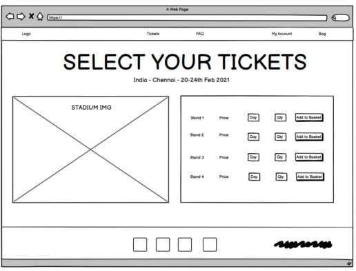
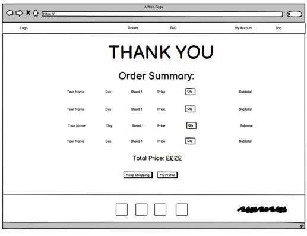

# MS4: England Cricket Tickets.

[View the live project here.](https://adamdelancey.github.io/ms4-england-cricket-tickets)

As my fourth and final submission for the Code Institute, this England Cricket Tickets website is an online store where users can purchase
tickets for England Cricket matches around the globe. They can select the day they want to visit, which stand, and how many tickets they would 
like to purchase. They can login to their accounts to see what tickets they have bought, read FAQs, and receive emails to notify them that new 
tickets have been added. The owner of the website will be able to create, read, update and delete new tours and tickets in order to keep the website 
updated. It is designed to be responsive and accessible on a range of devices, making it interactive and easy to navigate for potential users.

<p align="center">
    

# Access

View the project live: [here](https://ms4-england-cricket-tickets.herokuapp.com/)

View the Github repo: [here](https://adamdelancey.github.io/ms4-england-cricket-tickets)

## Contents

- [UX](#ux)
    - [Strategy](#strategy)
        - [Business Objectives](#business-objectives)
        - [User Stories](#user-stories)
            - [First Time Visitor Goals](#first-time-visitor-goals)
            - [Frequent User Goals](#frequent-user-goals)
            - [Admin Goals](#admin-goals)
    - [Scope](#scope)
        - [Current Features](#current-features)
            - [Opening Page](#opening-page)
            - [Base HTML](#base-HTML)
            - [Landing Page](#landing-page)
            - [Tip Page](#tip-page)
            - [Login/Register Page](#login/register-page)
            - [Profile Page](#profile-page)
            - [Add/Edit Tip Page](#add/edit-tip-page)
            - [Manage All Page](#manage-all-page)
        - [Long-term goals](#long-term-goals)
    - [Structure](#structure)
    - [Skeleton](#skeleton)
        - [Wireframes](#wireframes)
    - [Surface](#surface)
        - [Design](#design)
            - [Colour Scheme](#colour-scheme)
            - [Typography](#typography)
            - [Imagery](#imagery)
            - [Icons](#icons)
- [Information Architecture](#information-architecture) 
- [Accessibility](#accessibility)
    - [Alt Tags](#alt-tags)
- [Technologies used](#technologies-used)
    - [Languages Used](#languages-used)
    - [Frameworks, Libraries & Programs Used](#frameworks-libraries-&-programs-used)
- [Testing](#testing)
    - [Validation](#validation)
    - [Autoprefixer CSS Online](#autoprefixer-css-online)
    - [Lighthouse](#lighthouse)
    - [Testing User Stories from User Experience Section](#testing-user-stories-from-user-experience-section)
    - [Fixed Bugs](#fixed-bugs)
    - [Further Testing](#further-testing)
- [Deployment](#deployment)
     - [Cloning Tips from GitHub](#cloning-tips-from-GitHub)
     - [Deploying Tips to Heroku](#deploying-tips-to-Heroku)
- [Credits](#credits)
- [Disclaimer](#disclaimer)
- [Acknowledgements](#acknowledgements)

# UX

## Strategy

### Business Objectives

1. To become the best place for England supporters to buy tickets to England Cricket matches.
2. To create a site that has up-to-date information about matches, tickets and tours around the world.
3. To create a site that is enjoyable to browse and feels secure when purchasing tickets.
4. To create a site that can be easily managed for all future England cricket tours.

### User stories

-   #### First Time Visitor Goals

    As a First Time Visitor, I want to:

    1. Quickly understand the service being provided by England Cricket Tickets and how I can interact with the service.
    2. Be able to easily browse the various Tours and select which match I am interested in
    3. Having selected match, I want to choose where I want to sit and which days I would like to attend, as well as the number of tickets.
    4. Use my credit card to make an online payment, and receive an email to let me know that my payment has gone through.
    5. Register to the website to receive any offers
    6. Find the answers to any questions that I may have, and contact the company if I can't find them online.

-   #### Frequent User Goals

    As a Frequent User, I want to:
    1. Easily be able to check if any new tours have been added that may interest me.
    2. Login to the account that I have previously set up and see the information of the tickets I have purchased.
    3. Change my saved details, for example I have moved address or changed phone number.
    4. Buy additional tickets to the matches where I have previously bought tickets.
    5. Contact the company to ask any further questions.

-   #### Admin Goals

    As Admin, I want to:
    1. Be able to create, read, update and delete all tours, tickets and FAQs on the website.

## Scope

### Current features

* Base HTML - on all pages
    - ###

* Home Page
    - ###

* Tour Page
    - ### 

* Tickets Page
    - ###

* Profile Page
    - ###

* Manage Tours/Tickets Page
    - ###

* FAQs page
    - ###
  

### Long-term goals

Future improvements to the website may include:

* ###


## Structure

* ###


## Skeleton

### Wireframes

Desktop View
<p>
        
    
    
    </p>
    </p>
    </p>
    </p>
    </p>
    </p>

Tablet Pages
<p>
        
    
    
    </p>
    </p>
    </p>
    </p>
    </p>
    </p>

Mobile Pages
<p>
        
    
    
    </p>
    </p>
    </p>
    </p>
    </p>
    </p>

Full wireframes can be accessed here:

-   Desktop Wireframes - [View](wireframes/wireframes/tips-desktop.pdf)

-   Mobile & Tablet Wireframes - [View](wireframes/wireframes/tips-tablet-mobile.pdf)    


## Surface
   
### Design
-   #### Colour Scheme
    <p></p>
    -   ###

-   #### Typography
    -   ###

-   #### Imagery
    - ###
    - All photos were put through [Tiny PNG](https://tinypng.com/) to reduce the file size and improve loading time.

-   #### Icons
    -   The icons used throughout the site are taken from [Font Awesome](https://fontawesome.com/).

# Information Architecture

///////// is used for storing data for this website.

Current schema:
A txt version can be viewed [here](documentation/data/data.txt)

<p></p>


# Accessibility

## Alt Tags

In order to ensure that all images are accessible for those using a screen reader, I have ensured that all images used 
throughout the site include alt tags.

# Technologies used

## Languages Used

-   HTML5
-   CSS3
-   JavaScript
-   Python

## Frameworks, Libraries & Programs Used

*********************************************************
1. [MongoDB](https://www.mongodb.com/1)
    - MongoDB was used to host the data used on the site and was chosen due to the non-relational nature of the data.
1. [Flask](https://flask.palletsprojects.com/en/1.1.x/)
    - The Flask framework was used to import the Flask, flash, render_template, redirect, request, session, and url_for 
    functions that are used throughout the site.
1. [BSon](http://bsonspec.org/)
    - This was imported in order to access the data used across the site.
1. [Werkzeug](https://werkzeug.palletsprojects.com/en/1.0.x/)
    - This was imported in order for the password control to enhance security on the site.
1. [Jinja Templating](https://jinja.palletsprojects.com/en/2.11.x/templates/)   
    - This was used predominantly for the with, for loops and if statements in order to display all of the relevant data.
1. [JQuery](https://jquery.com/)
    - I have used JQuery predominantly to initialise the components used in the Materialize framework. In addition, I used 
    code taken from the Data Centric Development Module with the Code Institute in order to ensure that the category names are 
    a required attribute.
1. [Materialize 1.0.0](https://materializecss.com/)
    - Materialize was used to assist with the responsiveness and styling of the website, such as the navbars for desktop and 
    mobile, buttons, forms, cards and colours.
1. [Google Fonts](https://fonts.google.com/)
    - Google fonts were used to import the 'Sarala' font which is used on all pages throughout the project.
1. [Font Awesome](https://fontawesome.com/)
    - Font Awesome was used on all pages throughout the website to add icons for aesthetic and UX purposes. 
1. [Git](https://git-scm.com/)
    - Git was used for version control by utilising the Gitpod terminal to commit to Git and Push to GitHub.
1. [GitHub](https://github.com/)
    - GitHub is used to store the projects code after being pushed from Git.
1. [Heroku](https://dashboard.heroku.com/apps)
    - Heroku is used for the hosting of the site and is deployed through here.
1. [Balsamic](https://balsamiq.com/)
    - Balsamiq was used to create the wireframes during the design process.

# Testing

## Validation

The W3C Markup and CSS Validator Services, JSHint and Python Validator were used to validate every page of the project 
to ensure there were no syntax errors in the project.

-   [W3C Markup Validator](https://validator.w3.org/) - [Results](https://validator.w3.org/nu/?doc=https%3A%2F%2Fms3-tips.herokuapp.com%2F)
    This same result appears across every page of the site.
    <p>   </p> 
-   [W3C CSS Validator](https://jigsaw.w3.org/css-validator/) - [Results](https://jigsaw.w3.org/css-validator/validator?uri=https%3A%2F%2Fms3-tips.herokuapp.com%2F&profile=css3svg&usermedium=all&warning=1&vextwarning=&lang=en) -  
    There is 1 property issue found when checking the site. However, these are being validated from the Materialize 
    link and therefore out of my control.
    <p>   </p> 
-   [JSHint](https://jshint.com/) - 
    No issues were found on this check.
    <p> </p>      
-   [Python Validator](http://pep8online.com/)
    No issues were found on this check.
    <p> </p>   
    

## Autoprefixer CSS Online

This was used to parse CSS and add vendor prefixes in order to ensure that the CSS styling works properly across all 
browsers. I have added the below header to my CSS styles sheet in order to show this:
<p>   </p>

## Lighthouse

<p >Desktop
Mobile</p>

From Chrome Developer Tools, this Lighthouse score is based on the homepage while being viewed on desktop and mobile. The 
biggest variant throughout the site is the performance score, which is predominantly due to the image link added by users 
to the site for each individual Tip, making it quite hard to control. 


## Testing User Stories from User Experience Section

-   #### First Time Visitor Goals - I want to:

    1. Quickly understand the service being provided by England Cricket Tickets and how I can interact with the service.
        - *###*
    2. Be able to easily browse the various Tours and select which match I am interested in
        - *###*
    3. Having selected match, I want to choose where I want to sit and which days I would like to attend, as well as the number of tickets.
        - *###*
    4. Use my credit card to make an online payment, and receive an email to let me know that my payment has gone through.
        - *###*
    5. Register to the website to receive any offers
        - *###*
    6. Find the answers to any questions that I may have, and contact the company if I can't find them online.
        - *###*

    
-   #### Frequent User Goals - I want to:

    As a Frequent User, I want to:
    1. Easily be able to check if any new tours have been added that may interest me.
        - *###*
    2. Login to the account that I have previously set up and see the information of the tickets I have purchased.
        - *###*
    3. Change my saved details, for example I have moved address or changed phone number.
        - *###*
    4. Buy additional tickets to the matches where I have previously bought tickets.
        - *###*
    5. Contact the company to ask any further questions.
        - *###*


-   #### Admin Goals - I want to:
   
    1. Be able to create, read, update and delete all tours, tickets and FAQs on the website.
        - *###*


## Fixed Bugs
After deployment, I found multiple bugs that needed addressing:

1. Bug 1...
    - *###*
2.  Bug 2
    - *###*  
2.  Bug 3...
    - *###*  


## Further Testing

- ###


# Deployment

Tips was developed using GitPod, using Git and GitHub to host the repository.

## Cloning Tips from GitHub ##

Ensure you have the following installed:

- [PIP](https://pypi.org/project/pip/)
- [Python 3](https://www.python.org/)
- [Git](https://git-scm.com/)
- [Heroku CLI](https://devcenter.heroku.com/articles/heroku-cli)

In addition, create an account on [MongoDB](https://www.mongodb.com/) in order to create the database.

1. Clone the repository by either downloading from [my GitHub Page](https://github.com/adamdelancey/ms3-tips), or if you
already have Git installed, by typing the following command into your terminal:

```bash
git clone https://github.com/adamdelancey/ms3-tips
```

2. Navigate to this folder in your terminal window and install the required modules to run the application using the following command:

```bash
python -m pip -r requirements.txt
```

3. Initialise the virtual environment by typing the following command into the terminal:

```
py -m venv virtual
```

4. In MongoDB, create a new database called tips with three collections: categories, tips and users.

5. Back in GitPod create a file to hold your environment variables and call it env.py.

6. Your env.py file should contain the following:

```
import os

os.environ.setdefault("IP", "0.0.0.0")
os.environ.setdefault("PORT", "5000")
os.environ.setdefault("SECRET_KEY", "YOUR_SECRET_KEY")
os.environ.setdefault("MONGO_URI", "YOUR_MONGODB_URI")
os.environ.setdefault("MONGO_DBNAME", "YOUR_DATABASE_NAME")
```

- Make sure you update the secret keys and passwords.

- Before pushing the project to a public repository, add your env.py file to .gitignore.

7. You can now run your application locally by typing the following command into your terminal:

```
python run.py
```

## Deploying Tips to Heroku ##

1. Log in to Heroku and click create new app.

2. Create a requirements.txt file using the following command in GitPod:

```
pip3 freeze --local > requirements.txt
```

3. Create a Procfile with the following command:

```
echo web: python run.py > Procfile
```

4. Push these newly created files to your repository master.

5. Add heroku remote to your git repository by getting the heroku git URL from the heroku account settings. Then type the
following: 

```
git remote add heroku https://git.heroku.com/xxxxx
```

6. Push the page to your heroku account:

```
git push heroku master
```

7. In your heroku app, set the following variables:

Key|Value
:-----:|:-----:
HOSTNAME|0.0.0.0
PORT|5000
MONGO_URI|YOUR_MONGODB_URI
SECRET_KEY|YOUR_SECRET_KEY

Again, make sure to enter your own SECRET_KEY, and MONGO_URL.

8. Click the deploy button on the Heroku dashboard.
9. The site has been deployed to Heroku.


# Credits

- All professional images have been sourced from [Pixabay](https://pixabay.com/).
- The video on entry to the site is from [Pexels](https://www.pexels.com/video/timelapse-of-stockholm-at-night-852395/).
- The Navbar, Forms and Cards have been selected from Materialize templates and adapted using CSS.
- Initial instructions for setting up the site were taken from the Task Manager walkthrough from the [Code Institute](https://codeinstitute.net/).
- [Stack Overflow](https://stackoverflow.com/) and [W3C Schools](https://www.w3schools.com/) were used for occasional debugging or issues where I could not initially work out the solution myself.
- Fonts are from [Google Fonts](https://fonts.google.com/) and icons from [Font Awesome](https://fontawesome.com/).

# Disclaimer

I do not own any of the photos or text written for the individual Tips. Please contact me immediately in case of any
copyright issue and I will happily remove anything.

This project is for educational purposes only.

# Acknowledgements

- My mentor, Aaron Sinnott, for his support and mentorship during the project.
- The peer-code-review channel on Slack and their trusty channel leads for both code and design Tips.
- Friends and family for testing the site on their various devices.
