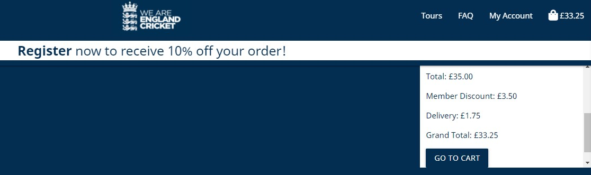

# MS4: England Cricket Tickets.

[View the live project here.](https://adamdelancey.github.io/ms4-england-cricket-tickets)

As my fourth and final submission for the Code Institute, this England Cricket Tickets website is an online store where users can purchase
tickets for England Cricket matches around the globe. They can select the day they want to visit, which stand, and how many tickets they would 
like to purchase. They can login to their accounts to see what tickets they have bought, read FAQs, and receive emails to notify them that new 
tickets have been added. The owner of the website will be able to create, read, update and delete new tours and tickets in order to keep the website 
updated. It is designed to be responsive and accessible on a range of devices, making it interactive and easy to navigate for potential users.

<p align="center">
    

# Access

View the project live: [here](https://ms4-england-cricket-tickets.herokuapp.com/)

View the Github repo: [here](https://adamdelancey.github.io/ms4-england-cricket-tickets)

## Contents

- [UX](#ux)
    - [Strategy](#strategy)
        - [Business Objectives](#business-objectives)
        - [User Stories](#user-stories)
            - [First Time Visitor Goals](#first-time-visitor-goals)
            - [Frequent User Goals](#frequent-user-goals)
            - [Admin Goals](#admin-goals)
    - [Scope](#scope)
        - [Current Features](#current-features)
            - [Opening Page](#opening-page)
            - [Base HTML](#base-HTML)
            - [Landing Page](#landing-page)
            - [Tip Page](#tip-page)
            - [Login/Register Page](#login/register-page)
            - [Profile Page](#profile-page)
            - [Add/Edit Tip Page](#add/edit-tip-page)
            - [Manage All Page](#manage-all-page)
        - [Long-term goals](#long-term-goals)
    - [Structure](#structure)
    - [Skeleton](#skeleton)
        - [Wireframes](#wireframes)
    - [Surface](#surface)
        - [Design](#design)
            - [Colour Scheme](#colour-scheme)
            - [Typography](#typography)
            - [Imagery](#imagery)
            - [Icons](#icons)
- [Information Architecture](#information-architecture) 
- [Accessibility](#accessibility)
    - [Alt Tags](#alt-tags)
- [Technologies used](#technologies-used)
    - [Languages Used](#languages-used)
    - [Frameworks, Libraries & Programs Used](#frameworks-libraries-&-programs-used)
- [Testing](#testing)
    - [Validation](#validation)
    - [Autoprefixer CSS Online](#autoprefixer-css-online)
    - [Lighthouse](#lighthouse)
    - [Testing User Stories from User Experience Section](#testing-user-stories-from-user-experience-section)
    - [Fixed Bugs](#fixed-bugs)
    - [Further Testing](#further-testing)
- [Deployment](#deployment)
     - [Cloning Tips from GitHub](#cloning-tips-from-GitHub)
     - [Deploying Tips to Heroku](#deploying-tips-to-Heroku)
- [Credits](#credits)
- [Disclaimer](#disclaimer)
- [Acknowledgements](#acknowledgements)

# UX

## Strategy

### Business Objectives

1. To become the best place for England supporters to buy tickets to England Cricket matches.
2. To create a site that has up-to-date information about matches, tickets and tours around the world.
3. To create a site that is enjoyable to browse and feels secure when purchasing tickets.
4. To create a site that can be easily managed for all future England cricket tours.

### User stories

-   #### First Time Visitor Goals

    As a First Time Visitor, I want to:

    1. Quickly understand the service being provided by England Cricket Tickets and how I can interact with the service.
    2. Be able to easily browse the various Tours and select which match I am interested in
    3. Having selected match, I want to choose where I want to sit and which days I would like to attend, as well as the number of tickets.
    4. Use my credit card to make an online payment, and receive an email to let me know that my payment has gone through.
    5. Register to the website to receive any offers
    6. Find the answers to any questions that I may have, and contact the company if I can't find them online.

-   #### Frequent User Goals

    As a Frequent User, I want to:
    1. Easily be able to check if any new tours have been added that may interest me.
    2. Login to the account that I have previously set up and see the information of the tickets I have purchased.
    3. Change my saved details, for example I have moved address or changed phone number.
    4. Buy additional tickets to the matches where I have previously bought tickets.
    5. Contact the company to ask any further questions.

-   #### Admin Goals

    As Admin, I want to:
    1. Be able to create, read, update and delete all tours, matches and tickets on the website.

## Scope

### Current features

* Base HTML - on all pages
    - Navbar - using Materialize's [mobile collapse feature](https://materializecss.com/navbar.html), I created two separate
    navbars, one for mobile and tablet devices, and one for laptops and larger screens. Both versions feature the England 
    cricket logo that acts as a link to the hompage, plus links to all of the Tours and FAQs, a My Account button where logged in 
    users can view their profile and others can register or sign in to an account, as well as a responsive cart icon and number that 
    will responsively reflect the grand total of the items in the shopping cart. The mobile version of the navbar additionally 
    features a sidenav that is triggered by a hamburger icon, that appears on the screen from the right as per below. 
    <p></p>
    - 10% offer - across the top of each page, the user is presented with an option to save 10% on their purchase by 
    registering to the website. There is a link to the registration page in the header, and immediately gives the user an 
    incentive to become a member. This improves click-through rate and means that the user is more likely to purchase a ticket 
    on this website.
    - Messages - using the Django import 'messages' from 'django-contrib' the site uses error, success, warning and info messages 
    across the site to keep the user updated on any important interaction, such as adding, updating or removing an item in the bag, 
    logging in to the site or viewing a previous order. These appear across the site at the top of the page, and on the success 
    messages, there is a feature to go directly to the shopping cart to proceed with the order:
    
    - Footer - this is split into three separate parts. First, a link to either all tours or one of the tours that the user is interested in 
    for convenience, social media links to external windows, and finally the England cricket logo for consistency. This provides the user 
    with easy navigation across the site both at the top and bottom of the page.  
     

* Home Page
    - Hero video (desktop devices) - upon entering the site, users are immediately presented with a looped 18s video 
    of one of the most famous moments in England's cricket recent history. If this doesn't get cricket fans excited upon 
    entering the site, I'm not sure what will! Due to the dimensions of the video, this works best on desktop devices only, 
    but is an exciting feature for the target audience and I believe creates a great first impression.
    - Hero image (mobile/tablet devices) - as a replacement for the aforementioned video, a photo of England's World Cup winning 
    team is immediately viewed by the user. As above, this should create an exciting first impression for the user and an 
    intrigue to purchase tickets given that they could witness another famous match.
    - Introduction text - on all devices, there is a simple introduction to the website that outlines the purpose of the site 
    and a link to go straight to the Tours page to purchase tickets. This means that the user will quickly understand the website 
    and have several options to navigate to the Tours page.

* Tour Page
    - Filter Button - at the top of the Tours page, the user can immediately filter the page to see a particular Tour 
    that they may be interested in. Alternatively, they can click the reset button and simply scroll through the various 
    options that they can purchase.
    - Tour image - for each tour there is a high quality photo of a member of the England cricket team. These photos create 
    a sense of professionalism and can attract the user into seeing one of their heroes play. Additionally, the photos 
    create a clear separation between the different Tours that are available.
    - Tour information - for each match, there is information on the teams playing, which match it is, the stadium that 
    the match is playing played at, the dates, and a button to go through to the Tickets page. This short summary is standard 
    for a ticketing website and allows the user to get as much information as quickly as possible.
    - Edit/delete match - for the admin/superuser only, there is an option next to each match that the user can click in to 
    either amend the details, or remove it completely. This is particularly useful for when a match is now finished and the admin 
    can remove it easily.
     

* Tickets Page
    - Stadium image - this image shows the available stands for which a user can purchase tickets. This links to an external 
    site so that the user can get a larger look if needed. These images create simplicity for the user in discovering what is 
    available, and means they can easily select the desired tickets by looking at the image as the names of the tickets reflect 
    the stands in the image.
    - Ticket information - here the user can see the different prices for the tickets that they can purchase, the quantity 
    to buy, and if it is a Test Match, the Day that they choose to go to. From here, they can buy tickets or return to the Tours 
    page to buy tickets for a different match if necessary. Upon clicking 'Buy Tickets' a success message will appear 
    and then the user can go to the cart to confirm their purchase. The cart in the navbar will also update the amount.
    - Edit/delete ticket - similar to the edit/delete match options, here the admin/superuser can edit or delete any ticket 
    throughout the site that may no longer be relevant.
    

* Cart Page
    - Summary - here the user can quickly see the match, stadium, day, stand, price and quantity of the tickets that 
    they are about to purchase. It's easy to understand and therefore user-friendly. At the bottom of the page, there is 
    also a summary on the order total, member discount (if applicable), delivery cost and grand total.
    - Update/remove buttons - here the user can update the quantity of the items in the cart, or remove it altogether. This saves 
    removing everything that it's in the cart and allows for a speedy interaction with the website.
    - Member discount - if the user has not yet created an account, here they again have the option to register to the website 
    so that they receive the 10% discount on their purchase:
     

* Checkout Page
    - Order summary - similar to the summary in the cart page above, the user is presented with a summary of what they 
    are about to purchase. This gives the user confidence that they can easily check that they have the correct items 
    in the cart before checking out and paying.
    - Payment - through [Stripe](https://stripe.com/en-gb-se) the user can enter their credit card details and make the 
    purchase successfully. The responsive form will let the user know if they have made any errors. 
    - Loading screen - once the user clicks submit, a loading image of a cricket ball spins on the page to let the user 
    know that the order is being processed.
     

* Checkout Success Page
    - Summary - this shows the order details, total and delivery details for the order and therefore acts as a very useful place 
    for the user to visit to check that their order is correct. 
    - Email confirmation - additionally, an email is sent to the user's email address letting them know that the order has 
    been processed:
     

* Profile Page
    - Split into two sections, the first shows the user's default delivery information, which if they have just made their first order, 
    will be automatically created with the details of their order. Here they can edit their default information which will speed 
    up the checking out process and therefore the user is more likely to make an order.
    - The second part shows the user's order history which shows the order number, date, items purchased and order total. The 
    user can click on the order number to view their past order, and then there is a message which lets the user know 
    that they are looking at an old order. 

* FAQs page
    - Using the [Materialize Collapsible](https://materializecss.com/collapsible.html) feature, the user can easily view 
    all of the questions and click on any that applies to them. The box then expands and reveals the answer to the user.
    

* Product Management page
    - Available only to the admin/superuser, in the 'My Account' dropdown in the navbar, the user can select Product 
    Management and then from there add a new match, ticket, tour or stadium to the list. This is necessary because a match 
    may be part of a new Tour, at a new Stadium, and feature tickets that have not yet been sold and therefore the admin 
    will need to create new options for all of these. 
    - Individual Add Page - the admin is then redirected to the relevant Add Page, and then has to simply fill in the short 
    form in order for the new item to be created.
  

### Long-term goals

Future improvements to the website may include:

* More filter options on Tours page, for example so that a user could filter by date, stadium or gametype.
* A blog section so that users could upload their own experiences or photos of matches that they have been to, comment on each 
other's posts and create a community atmosphere to the website.
* Add merchandise to the website so that users had the option to buy official England merchandise through the website, therefore 
expanding the product offering and making it more more likely that a user will make a purchase.


## Structure

* I made the decision programatically and thematically to have the site clearly split into different sections based on the Django 
installed apps - Home, Tours, Cart, Checkout, Profile and FAQ - as well as the allauth installed pages such as login, log out, register. 
This created a natural sales journey throughout the site, and with the consistency of the sticky navbar, footer, messages and design, 
it becomes very easy to navigate through the site.


## Skeleton

### Wireframes

Desktop View
<p>
        
    
    
    </p>
    </p>
    </p>
    </p>
    </p>
    </p>

Tablet Pages
<p>
        
    
    
    </p>
    </p>
    </p>
    </p>
    </p>
    </p>

Mobile Pages
<p>
        
    
    
    </p>
    </p>
    </p>
    </p>
    </p>
    </p>

Full wireframes can be accessed here:

-   Desktop Wireframes - [View](wireframes/wireframes/tips-desktop.pdf)

-   Mobile & Tablet Wireframes - [View](wireframes/wireframes/tips-tablet-mobile.pdf)    


## Surface
   
### Design
-   #### Colour Scheme
    
    - Taking inspiration from the England Cricket Boards' [official website](https://www.ecb.co.uk/), I have used the colour in the header,
    #042D52, to be the main color throughout the site in the header and buttons. As a seconday, complimentary colour, I have used 
    #1B466C as background for the site where there isn't imagery used as the background instead. As a lighter, brighter colour in 
    contrast to the darker blues, I have used off-white colour #F9FAFA for much of the text, to ensure it stands out and is easily 
    readable.
    - I used [Sessions.edu](https://www.sessions.edu/color-calculator/) to work out the correct complimentary colours, and 
    [Coolors](https://coolors.co/042d52-1b466c-f9fafa) to create the palette below.
    <p></p>

-   #### Typography
    -   The Noto Sans font is the main font used throughout the whole website with Sans Serif as the fallback font in case for 
    any reason the font isn't being imported into the site correctly. I chose this as I believe it has a modern feel and 
    reflects the style of the remainder of the site.

-   #### Imagery
    - I have predominantly used professional images throughout the site from [ESPN CricInfo](https://www.espncricinfo.com/ci/content/image/index.html)
    in order to ensure that the site looks professional. For the stadium images, these come from the individual stadium ticketing pages 
    in order to remain consistent across the site.
    - All photos were put through [Tiny PNG](https://tinypng.com/) to reduce the file size and improve loading time.

-   #### Icons
    -   The icons used throughout the site are taken from [Font Awesome](https://fontawesome.com/).

# Information Architecture

## Database Choice
- Development phase SQLight database was used for the development which is installed with Django.
- Deployment phase PostgreSQL was used on deployment stage, which is provided as add-on by Heroku application.
- User model is provided as a default by [Django's authentication system](https://docs.djangoproject.com/en/3.1/ref/contrib/auth/).


## Data Modelling
- All data related to tours is saved in JSON format in the tours fixtures folder, and the FAQ data is in the respective fixtures folder.
- I had initially attempted to have the tickets correspond to the stadium, rather than the match, but this caused issues as 
every match was then pulling through tickets for every match played at the stadium, and hence why I had to make the change.
- The below data model was created using [Drawl SQL](https://drawsql.app/tbc/diagrams/england-cricket-tickets#)
<p></p>


# Accessibility

## Alt Tags

In order to ensure that all images are accessible for those using a screen reader, I have ensured that all images used 
throughout the site include alt tags.

# Technologies used

## Languages Used

-   HTML5
-   CSS3
-   JavaScript
-   Python

## Frameworks, Libraries, Programs & Databases Used

*********************************************************
1. [Django](https://www.djangoproject.com/)
    - Used as the main Python framework throughout the site.
1. [Django Crispy Forms](https://django-crispy-forms.readthedocs.io/en/latest/)
    - Used for all forms across the site
1. [Django Allauth](https://django-allauth.readthedocs.io/en/latest/installation.html)
    - Used for all the login, logout, register pages and handles the forms.
1. [Materialize 1.0.0](https://materializecss.com/)
    - Materialize was used to assist with the responsiveness and styling of the website, such as the navbars for desktop and 
    mobile, buttons, forms and cards.
1. [Stripe](https://stripe.com/en-gb-se)
    - Stripe handles the payments on checkout site.
1. [Amazon Web Services](https://aws.amazon.com/)
    - Stores all the static CSS and JS files, as well as the media images and video.
1. [Jinja Templating](https://jinja.palletsprojects.com/en/2.11.x/templates/)   
    - This was used predominantly for the with, for loops and if statements in order to display all of the relevant data.
1. [JQuery](https://jquery.com/)
    - I have used JQuery predominantly to initialise the components used in the Materialize framework, Stripe and AOS.
1. [AOS](https://michalsnik.github.io/aos/)
    - Used for the fade-up feature on the tour page
1. [SQLite3](https://www.sqlite.org/index.html)
    - Database used in development
1. [PostgreSQL](https://www.postgresql.org/)
    - Database used for production
1. [Google Fonts](https://fonts.google.com/)
    - Google fonts were used to import the 'Sarala' font which is used on all pages throughout the project.
1. [Font Awesome](https://fontawesome.com/)
    - Font Awesome was used on all pages throughout the website to add icons for aesthetic and UX purposes. 
1. [Git](https://git-scm.com/)
    - Git was used for version control by utilising the Gitpod terminal to commit to Git and Push to GitHub.
1. [GitHub](https://github.com/)
    - GitHub is used to store the projects code after being pushed from Git.
1. [Heroku](https://dashboard.heroku.com/apps)
    - Heroku is used for the hosting of the site and is deployed through here.
1. [Balsamiq](https://balsamiq.com/)
    - Balsamiq was used to create the wireframes during the design process.

# Testing

Testing for the site has been recorded in a separate file - [Testing MD](https://github.com/adamdelancey/ms4-england-cricket-tickets/blob/master/readme_materials/testing.md)


# Deployment

## Heroku Deployment with AWS 

In order to deploy the site onto [Heroku](https://dashboard.heroku.com/apps), I took the following steps:
1. Installed gunicorn, psycopg2-binary and dj-database-url using [PIP](https://pypi.org/project/pip/).
2. Created a requirements.txt file and froze all the required modules to this file using ```pip3 freeze > requirements.txt```
3. Created a Procfile and added ```web: gunicorn ms4_england_cricket_tickets.wsgi:application```
4. ```git add```, ```git commit``` and ```git push``` to push these changes to my GitHub repository.
5. Logged into my Heroku account and created a new app, using Europe as my region.
6. Went to the Resources tab in Heroku, then in the Add-ons search bar added Heroku Postgres, selected the Free account, then clicked 
Submit Order Form in order to add it to my project.
7. In the dashboard for the application, I clicked on Settings, then Reveal Config Vars and set the following values:

|Key|Value|
|--|--|
|AWS_ACCESS_KEY_ID|```Your AWS Access Key```|
|AWS_SECRET_ACCESS_KEY|```Your AWS Secret Access Key```|
|DATABASE_URL	|```Your Postgres Database URL```|
|EMAIL_HOST_PASS|```Your Email Password (generated by Gmail)```|
|EMAIL_HOST_USER|```Your Email Address```|
|SECRET_KEY	|```Your Secret Key```|
|STRIPE_PUBLIC_KEY	|```Your Stripe Public Key```|
|STRIPE_SECRET_KEY	|```Your Stripe Secret Ke```y|
|STRIPE_WH_SECRET	|```Your Stripe WH Key```|
|USE_AWS	|```True```

8. In the Deploy tab, under Deployment method, selected GitHub and then set up automatic deploys. 
9. Commented out current DATABASE setting in settings.py, and add the following code instead - 
``` 
DATABASES = {     
        'default': dj_database_url.parse("<your Postrgres database URL here>")     
    }    
```
10. Wrote ```python3 manage.py makemigrations``` and ```python3 manage.py migrate``` in the terminal in order to migrate 
the database models to the Postgres database.
11. Loaded the data fixtures using the command ```python3 manage.py loaddata <fixture name>``` in the following order - Gametype,
Tour, Stadium, Match, Ticket, FAQ.
12. Created a new superuser using the command ```python3 manage.py createsuperuser``` and then entered my email, username and 
password.
13. Replaced the database setting with the following code so that the right database is being used depending on the environment:
```
if 'DATABASE_URL' in os.environ:
    DATABASES = {
        'default': dj_database_url.parse(os.environ.get('DATABASE_URL'))
    }
else:
    DATABASES = {
        'default': {
            'ENGINE': 'django.db.backends.sqlite3',
            'NAME': os.path.join(BASE_DIR, 'db.sqlite3'),
        }
    }
```
14. Entered ```heroku config:set DISABLE_COLLECTSTATIC=1``` into the terminal so that Heroku doesn't attempt to collect the static file.
15. Added ```ALLOWED_HOSTS = ['england-cricket-tickets.herokuapp.com', 'localhost', '127.0.0.1']``` to settings.py
16. In Stripe, added the Heroku app checkout URL as a new webhook.
17. Updated the settings.py with the new Stripe environment variables and email settings.
18. Commited all changes to Heroku

## Amazon Web Services

The static and media giles for the deployed site are hosted in the AWS S3 bucket. I created a new account, then a new S3 bucket
and uploaded the relevant static and media files. More guidelines can be found [here](https://docs.aws.amazon.com/AmazonS3/latest/userguide/creating-bucket.html).
I used the following CORS configuration:
```
[
  {
      "AllowedHeaders": [
          "Authorization"
      ],
      "AllowedMethods": [
          "GET"
      ],
      "AllowedOrigins": [
          "*"
      ],
      "ExposeHeaders": []
  }
]
```
1. Back in the terminal, I installed boto3 and django-storages using the ```pip3 install``` and then froze them using ```pip3 freeze > requirements.txt```
in order to connect the S3 bucket to Django.
2. Added 'storages' to the list of ```INSTALLED_APPS``` in settings.py
3. Added the following also in settings.py:
```
if 'USE_AWS' in os.environ:
    # Cache control
    AWS_S3_OBJECT_PARAMETERS = {
        'Expires': 'Thu, 31 Dec 2099 20:00:00 GMT',
        'CacheControl': 'max-age=94608000',
    }

    # Bucket Configration
    AWS_STORAGE_BUCKET_NAME = 'england-cricket-tickets'
    AWS_S3_REGION_NAME = 'eu-north-1'
    AWS_ACCESS_KEY_ID = os.environ.get('AWS_ACCESS_KEY_ID')
    AWS_SECRET_ACCESS_KEY = os.environ.get('AWS_SECRET_ACCESS_KEY')
    AWS_S3_CUSTOM_DOMAIN = f'{AWS_STORAGE_BUCKET_NAME}.s3.amazonaws.com'

    # Static and media files
    STATICFILES_STORAGE = 'custom_storages.StaticStorage'
    STATICFILES_LOCATION = 'static'
    DEFAULT_FILE_STORAGE = 'custom_storages.MediaStorage'
    MEDIAFILES_LOCATION = 'media'

    # Override static and media URLs in production
    STATIC_URL = f'https://{AWS_S3_CUSTOM_DOMAIN}/{STATICFILES_LOCATION}/'
    MEDIA_URL = f'https://{AWS_S3_CUSTOM_DOMAIN}/{MEDIAFILES_LOCATION}/'
```
4. Created a custom_storages.py file at the top level folder
5. Deleted DISABLE_COLLECTSTATIC from the Heroku Config Var.
6. Pushed all the changes to Github and thus Heroku.

## Local Deployment

For local deployment, follow these steps:
1. In the terminal, enter ```git clone https://github.com/adamdelancey/ms4-england-cricket-tickets.git```, alternatively 
follow [these steps](https://docs.github.com/en/github/creating-cloning-and-archiving-repositories/cloning-a-repository).
2. Create .env file in the root directory and add this to the .gitignore file. Add the following to the env file:
```
import os  
os.environ["DEVELOPMENT"] = "True"    
os.environ["SECRET_KEY"] = "<Your Secret Key>"
os.environ["STRIPE_PUBLIC_KEY"] = "<Your Stripe Public Key>"    
os.environ["STRIPE_SECRET_KEY"] = "<Your Stripe Secret Key>"    
os.environ["STRIPE_WH_SECRET"] = "<Your Stripe WH Secret Key>"   
```
3. Install the required packages with pip3 install -r requirements.txt
4. Migrate the models to create a databsae by using ```python3 manage.py makemigrations``` and ```python3 manage.py migrate```
5. Load the data fixtures(Gametype, Tour, Stadium, Match, Ticket, FAQ. ) into the database using the following command:
 ```python3 manage.py loaddata <fixture_name>```.
6. Create a superuser for the Postgres database by running with ```python3 manage.py createsuperuser```
7. Now you can access the app using the command ```python3 manage.py runserver```


# Credits

- All professional images have been sourced from [ESPN CricInfo](https://www.espncricinfo.com/ci/content/image/index.html)
- The video on entry to the site is a cropped version from [Youtube](https://www.youtube.com/watch?v=wamtTEVFDiA&ab_channel=England%26WalesCricketBoard).
- The Navbar, Forms and Cards have been selected from Materialize templates and adapted using CSS.
- Initial instructions for setting up the site were taken from the Boutique-Ado walkthrough from the [Code Institute](https://codeinstitute.net/).
- [Stack Overflow](https://stackoverflow.com/) and [W3C Schools](https://www.w3schools.com/) were used for occasional debugging or issues where I could not
initially work out the solution myself.
- Fonts are from [Google Fonts](https://fonts.google.com/) and icons from [Font Awesome](https://fontawesome.com/).

# Disclaimer

I do not own any of the photos or logos used across the site. Please contact me immediately in case of any copyright issue and
I will happily remove anything.

This project is for educational purposes only.

# Acknowledgements

- My mentor, Aaron Sinnott, for his support and mentorship during the project.
- The peer-code-review channel on Slack and their trusty channel leads for both code and design advice.
- Friends and family for testing the site on their various devices.
