- [Validation](#validation)
- [Autoprefixer CSS Online](#autoprefixer-css-online)
- [Lighthouse](#lighthouse)
- [Testing User Stories from User Experience Section](#testing-user-stories-from-user-experience-section)
- [Fixed Bugs](#fixed-bugs)
- [Further Testing](#further-testing)

## Validation

The W3C Markup and CSS Validator Services, JSHint and Python Validator were used to validate every page of the project 
to ensure there were no syntax errors in the project.

-   [W3C Markup Validator](https://validator.w3.org/) - [Results](https://validator.w3.org/nu/?doc=https%3A%2F%2Fengland-cricket-tickets.herokuapp.com%2F)
    This same result appears across every page of the site, and the error that shows is due to the base.html template being used across the site.
    <p> 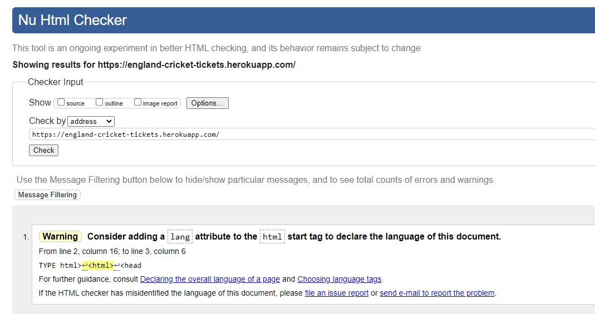  </p> 
-   [W3C CSS Validator](https://jigsaw.w3.org/css-validator/) - [Results](https://jigsaw.w3.org/css-validator/validator?uri=https%3A%2F%2F8000-ed7f6852-bcc5-4712-9035-464423e5cab7.ws-eu03.gitpod.io%2Ftours%2F&profile=css3svg&usermedium=all&warning=1&vextwarning=&lang=en) -  
    There is 1 property issue found when checking the site. However, these are being validated from the Materialize 
    link and therefore out of my control.
    <p> 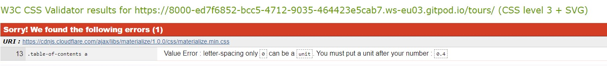  </p> 
-   [JSHint](https://jshint.com/) - 
    No issues were found on this check.        
-   [Python Validator](http://pep8online.com/)
    All PEP8 errors have been fixed throughout the site
    <p> 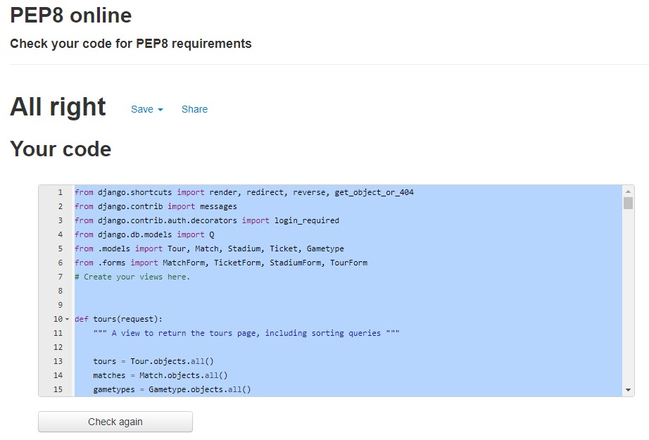</p>   
    

## Autoprefixer CSS Online

This [Autoprefixer](https://autoprefixer.github.io/) was used to parse CSS and add vendor prefixes in order to ensure that the CSS styling works properly across all 
browsers. I have added the below header to my CSS styles sheet in order to show this:
<p> 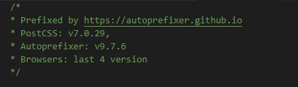  </p>

## Lighthouse

<p> 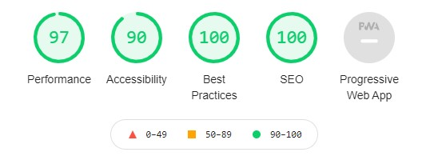</p>


From Chrome Developer Tools, this Lighthouse score is based on the FAQ while being viewed on desktop. The 
biggest variant throughout the site is the performance score, which is predominantly due to the image link
used for the images in the Tour page. 


## Testing User Stories from User Experience Section

-   #### First Time Visitor Goals - I want to:

    1. Quickly understand the service being provided by England Cricket Tickets and how I can interact with the service.
        - *Upon entering the site, there is a video on desktop or photo on mobile/tablet of two of the most famous moments 
        in England Cricket, immediately showing the user the theme for the site. Below that, there is a brief description of the
        purpose of the site, then also several links to the tour page including in the navbar, below the text, and footer.*
    2. Be able to easily browse the various Tours and select which match I am interested in.
        - *Firstly, on the main Tours page, the viewer is immediately presented with clear sections showing the different Tours 
        and Matches that are avaialable to purchase tickets for on the site. These clear sections have large, professional imagery 
        and give the key details of each match.*
        - *Also, there are two options to filter the Tours into the specific Tour that the user is interested in. This is firstly in the 
        'Filter' button at the top of the page, and also within the footer of every page:
        <p>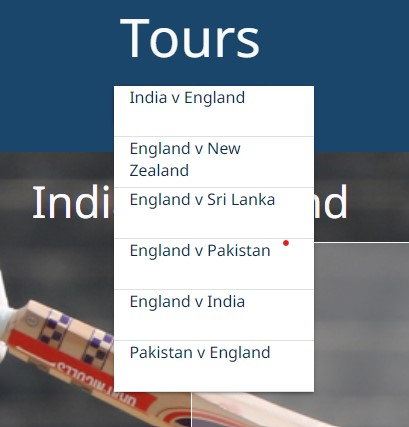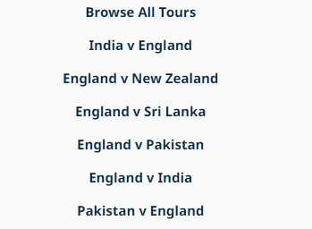</p>
    3. Having selected match, I want to choose where I want to sit and which days I would like to attend, as well as the number of tickets.
        - *Once the user has clicked 'Buy Tickets' on the Tours page, they are presented with an image of the stadium seating layout
        then a list of the tickets avaialable that correspond to the image. Each one has its own name and price, and here you can select the 
        quantity and if it is a Test Match, choose the day to attend.*
        <p>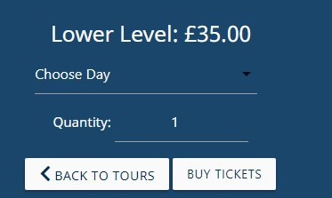</p>
    4. Use my credit card to make an online payment, and receive an email to let me know that my payment has gone through.
        - *On the checkout page, the site handles payments through Stripe, and here the user can enter his/her card details. 
        If the payment is handled successfully, the user will receive an email giving the details of their purchase.*
    5. Register to the website to receive any offers.
        - *After clicking the 'My Account' button in the navbar, the user can then register to the website. From here, they can enter 
        their details and then confirm their account via an email. Once confirmed, they will receive a 10% offer on their purchase. If 
        the user is about to make a purchase without registering, they will have the chance to do so at the Cart screen as a reminder.*
        Additionally, through the admin page, the site admin will be able to login and see all of their users and email addresses of those 
        who have registered. With their permission, they can then contact them to send details of any further offers.
        <p>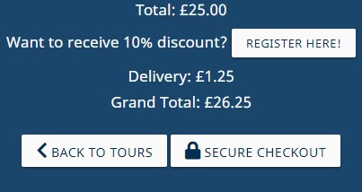</p>
    6. Find the answers to any questions that I may have, and contact the company if I can't find them online.
        - *An FAQ page has been added in order to answer any common questions. One of the questions also involves what to do if 
        the user's question is not answered from this page.*
    
-   #### Frequent User Goals - I want to:

    As a Frequent User, I want to:
    1. Easily be able to check if any new tours have been added that may interest me.
        - *Via the filter on the Tours page or the matches listed in the footer of each page, it will be easy for the user to 
        quickly understand if there are any tours being featured that they have not seen before.*
    2. Login to the account that I have previously set up and see the information of the tickets I have purchased.
        - *In the navbar, a user can login to the account that they have previously set up. Then, there is an option to view their 
        profile, then see their order history. From here, they can click on the order number and view the full details of the order.*
        <p></p>
    3. Change my saved details, for example if I have moved address or changed phone number.
        - *Similarly to above, on the My Profile page there is a form that shows the user's saved details. Here, they have the option 
        to update any of the details that are no longer relevant.*
        <p>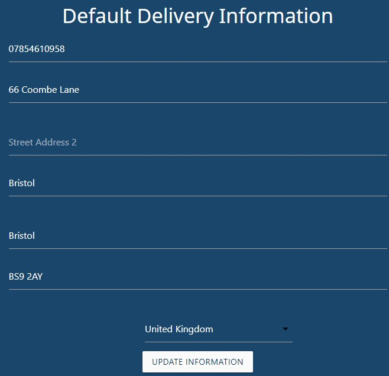</p>
    4. Buy additional tickets to the matches where I have previously bought tickets.
        - *By checking the user's order history, they are able to quickly view any of their previous ticket purchases. They can then 
        find this tour in the list, and if still available, purchase more tickets.*
    5. Contact the company to ask any further questions.
        - *There are details for the company contact details in the FAQ page for the user to use.*


-   #### Admin Goals - I want to:
   
    1. Be able to create, read, update and delete all tours, matches and tickets on the website.
        - *If the admin is logged into their admin/superuser account, they have the option to click Product Management in 
        the navbar. Here, they are faced with the below page where they can add any Tour, Ticket, Match or Stadium. Additionally,
        on the Tours page and each Ticket page, the admin click on the Edit or Delete button and make the required changes. Finally, 
        on the user admin page, they are able to make any changes across the site to any fixtures.*
        <p>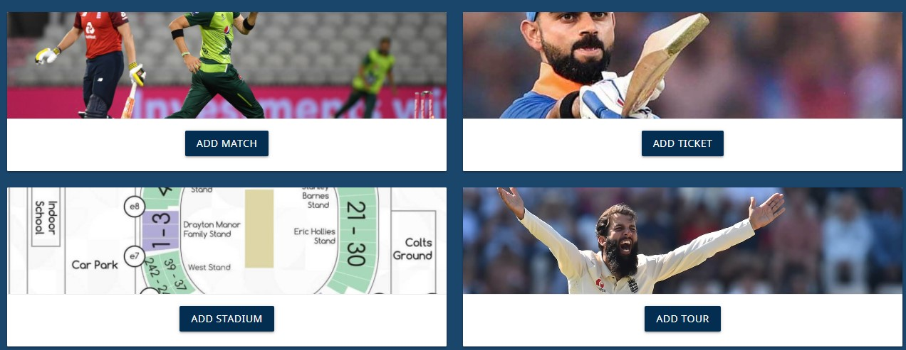</p>


## Fixed Bugs
After deployment, I found multiple bugs that needed addressing:

1. Tickets page pulling through the tickets of every match at that stadium.
    - *This was due to the original database models that I had attempted to use. Initially, I tried to have each ticket related to 
    the stadium rather than the match. However, the issue was that multiple matches are played at the same stadium, and therefore when you 
    clicked buy ticket, it was pulling through every match at that stadium, not just the one clicked on. Therefore, I changed the 
    data models and changed the relationship between the tour, match and ticket instead.*
2.  List of Tours in the footer only appearing on home page.
    - *In order to fix this, I added the below function to each view, as well as adding 'tours' to the contexts. This allowed the list 
    to show on each page across the site.*
    ```
    if request.GET:
        if 'tour' in request.GET:
            all_tours = Tour.objects.all()
            tour = request.GET['tour']
            tours = all_tours.filter(name=tour)
    ```  
3.  Two order numbers were being created for every order, rather than one.
    - *On the admin page I noticed that each time an order was being created, it was checking to see if there was a matching grand_total 
    to a previous order. By removing this from the webhook_handler.py handle_payment_intent_succeeded() function, the grand_total was 
    no longer checked, and this meant that the order numbers no longer duplicated.*  
4. Member discount was not being applied on the checkout_success page or order_history
    - *I attempted a range of print statements to see if the user_profile was being pulled through properly. When I realised that 
    it was, I had to add order.update_total() to the views.py, and this solved the issue.*
5. Cart page form and checkout page were not responsive on mobile.
    - *The initial layout of the cart and checkout pages did not handle well on mobile devices. In order to solve this and not create a
    too large HTML file, I added a cart_mobile.html page with a new layout, and then used the  method, alongside the 
    appropriate CSS, to handle this properly.*
6. Video did not display well on mobile
    - *Similarly to the note above, the video did not look good on mobile or tablet devices as these screen sizes are too narrow.
    I therefore used a well-known photo instead of the video, which works well responsively on these smaller devices.*

## Further Testing

- Each link and in particular the whole buying process and CRUD functionality for the superuser have been tested thoroughly to ensure 
that they are working effectively.
- Throughout the development process, I used the Chrome Developer Tools, specifically by using the print() function to test Python
 code, as well as for the various CSS designs, particularly around responsiveness.
- The website has been tested on various desktop browsers such as Google Chrome, Firefox, Safari and Edge, as mentioned above, I used the
 CSS tool Autoprefixer Online to help with this.
- Friends and family were also asked for advice particularly on layout and in order to ensure that the site was being tested across various devices.